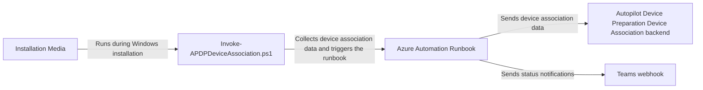

# APDP-DeviceAssociation-Service


The APDP (Autopilot Device Preparation) Device Association Service is a PowerShell-based community tool that organizations can use to automate the pre-association process for Autopilot Device Preparation devices.
One of the biggest gaps in the current Autopilot Device Preparation device association concept is the lack of OEM support. If you order hardware from an OEM or reseller, there is currently no way for them to link that hardware directly to your tenant, unlike with Windows Autopilot.

This solution aims to close that gap by integrating a client-side script and an Azure script into your current imaging solution. This ensures that the device is pre-associated with your tenant and can optionally be assigned to the correct Autopilot Device Preparation profile.
During the OOBE phase, the device will transition from the pre-association state to the associated state.

To receive notifications about the script's actions, you can set up a Teams webhook:


## Overview 

A high level overview about the solution looks like this: 



1. The solution is implemented on your installation media, or you can run the `Invoke-APDPDeviceAssociation.ps1` script manually at the beginning of OOBE if you receive a device with a clean image.
2. The script collects the device's `.devicelink.csv` file and sends the data to the Azure Automation webhook specified in `Invoke-APDPDeviceAssociation.ps1`.
3. The Azure Automation runbook is triggered by the webhook, validates the received payload, and adds or updates the Autopilot Device Preparation association in the backend.
4. The Azure Automation runbook can trigger a Teams webhook to post a notification to a channel, informing IT administrators that the task has completed.

## Client Side Script

The client-side script, `Client/Invoke-APDPDeviceAssociation.ps1`, runs on the device during Windows installation or another elevated provisioning stage. It collects the APDP device-link data generated by Windows, sends it to the Azure Automation webhook, and records execution details in a local log file.

### Client-side workflow

```mermaid
flowchart LR
    Media[Installation media] --> Unattend[unattend.xml specialize pass]
    Unattend --> Start[Start client script from C:\Windows\Temp]
    Start --> Admin{Running elevated?}
    Admin -- No --> AdminError[Show administrator error and stop]
    Admin -- Yes --> Collect[Run MdmDiagnosticsTool.exe]
    Collect --> Extract[Extract diagnostics CAB]
    Extract --> DeviceLink{Find *.devicelink.csv?}
    DeviceLink -- No --> SupportError[Show APDP support error and stop]
    DeviceLink -- Yes --> Parse[Read SerialNumber, Manufacturer, Model, and Data]
    Parse --> Network{Webhook reachable?}
    Network -- No --> RetryNetwork[Prompt for network retry or cancel]
    RetryNetwork --> Network
    Network -- Yes --> Payload[Build JSON request payload]
    Payload --> Webhook[POST payload to Azure Automation webhook]
    Webhook --> Result{Request successful?}
    Result -- Yes --> Complete[Write success to log and finish]
    Result -- HTTP 404 --> Expired[Show expired webhook error and stop]
    Result -- Other error --> RetryRequest[Prompt to retry or cancel]
    RetryRequest --> Webhook
```



The `unattend.xml` file starts the client script during the Windows `specialize` pass. The script then verifies that it is running with administrator or `SYSTEM` privileges, runs `MdmDiagnosticsTool.exe` with the Autopilot diagnostics area, extracts the resulting CAB file, and searches for the `*.devicelink.csv` file. The CSV values are converted into a JSON payload and sent to the runbook. Network failures can be retried interactively; an HTTP 404 is treated as an expired or deleted webhook and stops the process with a renewal message.

### Prerequisites

| Requirement | Details |
|---|---|
| Supported Windows build | The device must support Autopilot Device Preparation and generate a `*.devicelink.csv` file in the Autopilot diagnostics output. More information about supported Windows builds can be found in the official [Microsoft docs](https://learn.microsoft.com/en-gb/autopilot/device-preparation/device-association/requirements?tabs=software). |
| Elevated execution | Run the script as a local administrator or as `SYSTEM`. `MdmDiagnosticsTool.exe` requires administrative rights. |
| Windows tools | `MdmDiagnosticsTool.exe` and `expand.exe` must be available on the device. |
| Azure Automation webhook | A valid HTTPS webhook URI for the `Invoke-APDPDeviceImport` runbook must be configured. Webhook URIs cannot be viewed again in Azure after creation. |
| Network access | The device must resolve the webhook host and connect over TCP port 443. |
| File-system access | The execution context must be able to create and remove files under `C:\Program Files\APDP-DeviceAssociater`, or under custom paths supplied to the function. |
| User-interface support | The script uses `System.Windows.Forms` for retry and error dialogs. Therefore the script is referenced using the unattend.xml file. |
| Installation media layout | Copy `unattend.xml` to `Sources\$OEM$\$$\Panther\Unattend` and `Invoke-APDPDeviceAssociation.ps1` to `Sources\$OEM$\$$\Temp`. Windows maps the script to `C:\Windows\Temp` during setup. |

### Client script parameters

The public function is `Invoke-APDPDeviceAssociation`. All parameters are optional in the function definition. In practice, `WebhookUri` must resolve to a valid URI before the request is sent. The script invokes the function at the end of the file with environment-specific values.

When the script is launched by `unattend.xml`, the XML does not pass PowerShell parameters directly. The values are configured in the final `Invoke-APDPDeviceAssociation` call at the bottom of the `.ps1` file. Keep the XML path and the script path synchronized with the installation-media layout.

| Name | Type | Mandatory | Default | Description / options |
|---|---|---:|---|---|
| `WebhookUri` | `string` | Yes | Value supplied by the final invocation | Azure Automation webhook URI that receives the device-link payload. Use the HTTPS URI generated for the runbook webhook. |
| `APDPProfileId` | `string` | No | Empty | Optional APDP device preparation policy ID. When supplied, it is added to the JSON payload as `APDPProfileId`; when omitted, the device is associated without requesting a profile. |
| `CabPath` | `string` | No | `C:\Program Files\APDP-DeviceAssociater\AP.cab` | Path where `MdmDiagnosticsTool.exe` writes the Autopilot diagnostics CAB. The parent folder is created if required. |
| `ExtractPath` | `string` | No | `C:\Program Files\APDP-DeviceAssociater\Extracted` | Folder used to extract the diagnostics CAB. Existing contents are removed before extraction. |
| `ResourceGroup` | `string` | No | Empty | Azure resource group name used only to add context to an expired-webhook error. |
| `AutomationAccountName` | `string` | No | Empty | Azure Automation Account name used only to add context to an expired-webhook error. |
| `RunbookName` | `string` | No | Empty | Azure Automation runbook name used only to add context to an expired-webhook error. |

### `unattend.xml` integration

The supplied `Client/unattend.xml` starts the client script during the `specialize` pass with the following command:

```xml
<Path>powershell.exe -NoProfile -WindowStyle Hidden -ExecutionPolicy Bypass -File "C:\Windows\Temp\Invoke-APDPDeviceAssociation.ps1"</Path>
```

The expected installation-media layout is:

| Installation-media path | Destination during Windows setup | Purpose |
|---|---|---|
| `Sources\$OEM$\$$\Panther\Unattend\unattend.xml` | Windows setup configuration | Starts the client script during the `specialize` pass. |
| `Sources\$OEM$\$$\Temp\Invoke-APDPDeviceAssociation.ps1` | `C:\Windows\Temp\Invoke-APDPDeviceAssociation.ps1` | Provides the script called by the XML command. |

The webhook URI, APDP profile ID, and optional Azure resource details must be configured in the final function invocation inside the PowerShell script before the installation media is used.

### Invocation examples

#### Basic association without a profile

```powershell
Invoke-APDPDeviceAssociation `
    -WebhookUri 'https://example.webhook.office.com/webhookb29/...'
```

This collects and submits the device-link data without requesting an APDP profile. The runbook can still associate the device with the tenant.

#### Association with an APDP profile

```powershell
Invoke-APDPDeviceAssociation `
    -WebhookUri 'https://example.webhook.office.com/webhookb29/...' `
    -APDPProfileId 'e7dd4e7a-260d-4a7a-84c7-da46c608879b'
```

This adds the requested profile ID to the payload. The runbook validates the profile before assigning it to the new or existing tenant-associated device.

#### Custom diagnostic paths

```powershell
Invoke-APDPDeviceAssociation `
    -WebhookUri 'https://example.webhook.office.com/webhookb29/...' `
    -CabPath 'D:\APDP\AP.cab' `
    -ExtractPath 'D:\APDP\Extracted'
```

This stores the diagnostics CAB and extracted files outside the default `Program Files` location. The account running the script must have write access to both paths.

#### Add Azure Automation context to webhook errors

```powershell
Invoke-APDPDeviceAssociation `
    -WebhookUri 'https://example.webhook.office.com/webhookb29/...' `
    -ResourceGroup 'rg-endpoint-management' `
    -AutomationAccountName 'aa-apdp-prod' `
    -RunbookName 'Invoke-APDPDeviceImport'
```

This does not change the association payload. If the webhook returns HTTP 404, the supplied values are included in the error message so the operator can identify the Azure Automation resources that require a new webhook.

#### Full configuration

```powershell
Invoke-APDPDeviceAssociation `
    -WebhookUri 'https://example.webhook.office.com/webhookb29/...' `
    -APDPProfileId 'e7dd4e7a-260d-4a7a-84c7-da46c608879b' `
    -CabPath 'C:\ProgramData\APDP\AP.cab' `
    -ExtractPath 'C:\ProgramData\APDP\Extracted' `
    -ResourceGroup 'rg-endpoint-management' `
    -AutomationAccountName 'aa-apdp-prod' `
    -RunbookName 'Invoke-APDPDeviceImport'
```

This combines profile assignment, custom working paths, and Azure resource context. It is suitable for an installation workflow where the script is deployed with environment-specific configuration.

#### Run through `unattend.xml`

The installation-media workflow does not call the function from a command prompt. Instead, Windows Setup reads `unattend.xml`, copies the script to `C:\Windows\Temp`, and executes the script automatically:

```xml
<RunSynchronousCommand wcm:action="add">
    <Path>powershell.exe -NoProfile -WindowStyle Hidden -ExecutionPolicy Bypass -File "C:\Windows\Temp\Invoke-APDPDeviceAssociation.ps1"</Path>
    <Order>1</Order>
    <Description>Run Invoke-APDPDeviceAssociation.ps1</Description>
</RunSynchronousCommand>
```

In this mode, the script's final `Invoke-APDPDeviceAssociation` call supplies the configured parameters. The XML is responsible for timing and launching the script; it does not replace the PowerShell parameter configuration.

## Azure Automation Runbook 

The Azure Automation runbook, `AzureAutomation/Invoke-APDPDeviceImport.ps1`, receives the client payload through an Azure Automation webhook. It authenticates to Microsoft Graph with the Automation Account's system-assigned managed identity, checks the current tenant association, optionally validates and applies an APDP profile, optionally removes a matching Windows Autopilot hardware hash, and sends an optional Teams notification.

### Runbook workflow

```mermaid
flowchart LR
    Webhook[Azure Automation webhook] --> Validate[Validate webhook JSON and required properties]
    Validate --> Graph[Connect to Microsoft Graph with managed identity]
    Graph --> Hash[Find matching Windows Autopilot hardware hash]
    Hash --> HashDecision{RemoveExistingHardwareHash?}
    HashDecision -- Yes --> DeleteHash[Delete matching hardware hash]
    HashDecision -- No --> KeepHash[Retain hardware hash]
    DeleteHash --> Profile
    KeepHash --> Profile
    Profile[Validate optional APDPProfileId] --> Devices[Retrieve tenant-associated devices]
    Devices --> Existing{Device already associated?}
    Existing -- No --> Import[Import device-link data]
    Existing -- Yes --> ProfileMatch{Requested profile differs?}
    ProfileMatch -- Yes --> Update[Update APDP profile]
    ProfileMatch -- No --> NoChange[No association update required]
    Import --> Outcome[Set outcome event]
    Update --> Outcome
    NoChange --> Outcome
    Outcome --> Notify{TeamsWebhookUri supplied?}
    Notify -- Yes --> Teams[Send filtered Teams notification]
    Notify -- No --> Complete[Complete runbook]
    Teams --> Complete
    Validate -. Invalid payload .-> Failed[Fail job]
    Graph -. Authentication or Graph error .-> Failed
    Import -. Import error .-> Failed
    Update -. Update error .-> Failed
    Failed --> FailureNotice[Optional Failed notification]
```



The webhook payload is validated before any Graph operation is performed. The runbook then checks for an existing Windows Autopilot hardware hash, validates the requested APDP profile when one is supplied, and retrieves tenant-associated devices using Graph paging. A missing device is imported; an existing device is updated only when its requested APDP profile differs. Teams notifications are optional and can be filtered by event.

### Prerequisites

| Requirement | Details | Why it is required |
|---|---|---|
| Azure Automation Account | Use an Automation Account with a system-assigned managed identity and a published PowerShell runbook. | The managed identity provides passwordless authentication to Microsoft Graph, and the runbook hosts the webhook entry point. |
| PowerShell runtime | Use the configured PowerShell runtime environment, currently PowerShell `7.6` in the setup guidance. | The runbook is authored for the Azure Automation PowerShell runtime and the installed Graph module. |
| `Microsoft.Graph.Authentication` module | Install it in the Automation runtime environment. | Provides `Connect-MgGraph`, `Get-MgContext`, and `Invoke-MgGraphRequest`, which the runbook uses for Graph authentication and API calls. |
| `DeviceManagementServiceConfig.ReadWrite.All` | Grant this Microsoft Graph application permission to the Automation Account managed identity and provide admin consent. | Allows the runbook to read and modify tenant-associated device and Windows Autopilot device-management data, including importing associations and removing matching hardware-hash records. |
| `Device.Read.All` | Grant this Microsoft Graph application permission and provide admin consent. | Allows the runbook identity to read device identity data needed to locate the device and correlate the submitted serial number with existing records. |
| `DeviceManagementConfiguration.Read.All` | Grant this Microsoft Graph application permission and provide admin consent. | Allows the runbook to read configuration policies and validate that the supplied `APDPProfileId` exists before it is used. |
| Azure Automation webhook | Create and publish a webhook for the runbook and configure its URI in the client script. | The client uses the webhook to submit the device-link payload without requiring direct Graph credentials on the device. |
| Managed identity consent | An administrator with permission to grant application permissions must approve the Graph permissions for the managed identity. | Application permissions run without an interactive user and therefore require tenant-wide admin consent. |
| Optional Teams webhook | Provide one or more HTTPS Teams or Power Automate webhook URLs if notifications are required. | The runbook can report `Added`, `Updated`, `NoChangeRequired`, `HardwareHashRemoved`, and `Failed` outcomes to operations channels. |

### Runbook parameters

The public function is `Invoke-APDPDeviceImport`. Azure Automation supplies `WebhookData` when the webhook triggers the runbook. The other parameters control optional cleanup and notification behavior.

| Name | Type | Mandatory | Options / default | Description |
|---|---|---:|---|---|
| `WebhookData` | `object` | Yes | Azure Automation webhook object | Contains the request body submitted by the client script. The body must be a JSON object with the required properties listed below. |
| `RemoveExistingHardwareHash` | `switch` | No | Omitted by default | When present, deletes a Windows Autopilot hardware hash record whose serial number matches the submitted device. Without it, the record is retained. |
| `TeamsWebhookUri` | `string[]` | No | Empty by default | One or more HTTPS Teams or Power Automate webhook URLs. When omitted, no Teams notification is sent. |
| `TeamsEvent` | `string[]` | No | All events by default | Optional filter with `Added`, `Updated`, `NoChangeRequired`, `HardwareHashRemoved`, and `Failed`. Only selected events are sent to Teams. |

#### Teams event values

The table below provides a detailed overview of the Teams event values and what they report.

| Event | Meaning |
|---|---|
| `Added` | The device was not previously associated with the tenant and was imported successfully through the Microsoft Graph tenant-associated device API. |
| `Updated` | The device was already associated with the tenant, but its APDP profile differed from the requested profile. The runbook updated the association to use the requested profile. |
| `NoChangeRequired` | The device was already associated and no APDP profile update was needed. This can also occur when an import returns HTTP `409`, indicating that the device was created concurrently. |
| `HardwareHashRemoved` | The APDP association was already current, but an existing Windows Autopilot hardware hash was deleted because `RemoveExistingHardwareHash` was specified. |
| `Failed` | The workflow encountered an error. The Teams notification includes the error message when available, and the Azure Automation job output contains the full execution details. |

### Webhook request body

The client sends these properties inside `WebhookData.RequestBody`:

| Property | Type | Mandatory | Description |
|---|---|---:|---|
| `SerialNumber` | `string` | Yes | Serial number used to locate an existing tenant-associated device and matching hardware hash. |
| `Manufacturer` | `string` | Yes | Device manufacturer from the client device-link CSV. |
| `Model` | `string` | Yes | Device model from the client device-link CSV. |
| `Data` | `string` | Yes | Device-link data generated by Windows and passed to the Graph import endpoint. |
| `APDPProfileId` | `string` | No | Optional device preparation policy ID. The runbook checks that it exists before using it. |

Example request body:

```json
{
    "SerialNumber": "ABC123456",
    "Manufacturer": "Microsoft Corporation",
    "Model": "Surface Laptop",
    "Data": "<device-link-data>",
    "APDPProfileId": "e7dd4e7a-260d-4a7a-84c7-da46c608879b"
}
```

### Invocation examples

#### Process the webhook payload without optional actions

```powershell
Invoke-APDPDeviceImport `
    -WebhookData $WebhookData
```

This processes the submitted device, imports it when it is not already associated, and updates an APDP profile only when the payload requests one. Existing hardware hashes are retained and no Teams notification is sent.

#### Remove an existing hardware hash

```powershell
Invoke-APDPDeviceImport `
    -WebhookData $WebhookData `
    -RemoveExistingHardwareHash
```

This performs the normal association workflow and deletes a matching Windows Autopilot hardware hash when one exists. The switch is the only setting that enables deletion.

#### Send every outcome to Teams

```powershell
Invoke-APDPDeviceImport `
    -WebhookData $WebhookData `
    -TeamsWebhookUri @(
        'https://example.webhook.office.com/webhookb29/...'
    )
```

This sends all supported event types to the supplied HTTPS endpoint. The notification does not change the association operation.

#### Send only selected events

```powershell
Invoke-APDPDeviceImport `
    -WebhookData $WebhookData `
    -TeamsWebhookUri @(
        'https://example.webhook.office.com/webhookb29/...'
    ) `
    -TeamsEvent @(
        'Added',
        'Updated',
        'Failed'
    )
```

This reports successful additions, APDP profile updates, and failures while suppressing no-change and hardware-hash-removal notifications.

#### Remove the hash and notify operations and security

```powershell
Invoke-APDPDeviceImport `
    -WebhookData $WebhookData `
    -RemoveExistingHardwareHash `
    -TeamsWebhookUri @(
        'https://example.webhook.office.com/webhookb29/operations...',
        'https://example.webhook.office.com/webhookb29/security...'
    ) `
    -TeamsEvent @(
        'HardwareHashRemoved',
        'Failed'
    )
```

This deletes the matching hardware hash when requested and sends removal or failure notifications to both HTTPS endpoints.

## Setup Guide

I prepared the following setup guide if you want to deploy the solution within your environment: 
1. [Setup-Azure Automation](/Documentation/01-Setup-AzureAutomation.md)
2. [Prepare-ClientSetupScript](/Documentation/02-Prepare-ClientSetupScript.md)
3. [Prepare-InstallationMedia](/Documentation/03-Prepare-Installationmedia.md)
4. [[Optional] Setup Teams Webhook](/Documentation/04-[Optional]%20Setup-TeamsWebhook.md)
5. [Finalize Azure Automation Runbook](/Documentation/05-FinalizeAzureAutomationRunbook.md)

## Troubleshooting

Use the component-specific sections below to identify where the workflow stopped. The client-side script writes its log to `C:\Program Files\APDP-DeviceAssociater\apdp_association_log.txt`. Azure Automation failures are recorded in the runbook job output.

### Installation media and `unattend.xml`

| Symptom | Likely cause | Check / resolution |
|---|---|---|
| The client-side script never starts during Windows setup. | `unattend.xml` is in the wrong folder or is not included on the installation media. | Confirm that `unattend.xml` is under `Sources\$OEM$\$$\Panther\Unattend` and that the file contains the `specialize` pass and `RunSynchronousCommand` entry. |
| Windows setup starts but cannot find the PowerShell script. | The script is not in the path expected by `unattend.xml`. | Copy `Invoke-APDPDeviceAssociation.ps1` to `Sources\$OEM$\$$\Temp`. The file should become available at `C:\Windows\Temp\Invoke-APDPDeviceAssociation.ps1`. |
| The installation media contains an old webhook configuration. | The PowerShell script was updated but the installation media was not rebuilt. | Update the final `Invoke-APDPDeviceAssociation` invocation in the client script and recreate or update the installation media. |

### Client-side script

The following table covers the main errors displayed by `Client/Invoke-APDPDeviceAssociation.ps1`.

| Client-side error or symptom | Meaning | Resolution |
|---|---|---|
| **Administrator rights required** | The client script is not running as a local administrator or `SYSTEM`. | Run the installation workflow with elevation. When using `unattend.xml`, confirm the command runs during the `specialize` pass in the expected system context. |
| **Network connection required** or webhook host is unreachable  | The client cannot reach the Azure Automation webhook host over TCP port 443. | Connect the device to a network, verify DNS and outbound HTTPS access, then select **Retry**. Select **Cancel** only when the operation should stop. |
| **Webhook is no longer valid** or HTTP `404`  | The Azure Automation webhook used by the client has expired, been deleted, or is invalid. | Create a new webhook for the published runbook, update `-WebhookUri` in the client script, and rebuild or redeploy the installation media. |
| **Autopilot Device Preparation is not available** | The extracted diagnostics do not contain a `*.devicelink.csv` file. | Use a Windows build and installation image that supports APDP, then run the client script again. |
| **Autopilot diagnostics collection failed** | `MdmDiagnosticsTool.exe` returned a failure or did not create the expected CAB file. | Confirm that `MdmDiagnosticsTool.exe` is available, the script is elevated, and the CAB parent folder is writable. Check the client log for the exit code and expected CAB path. |
| **Device-link data is incomplete** | The device-link CSV exists but does not contain a usable `Data` value. | Recollect the diagnostics. If the issue continues, verify that the Windows build supports APDP and that the diagnostics were generated on the target device. |
| The client repeatedly displays a retry prompt after a failed POST. | The webhook request failed for a temporary network or HTTP reason other than 404. | Check network connectivity, proxy or firewall rules, and the webhook URI. Select **Retry** after correcting the issue or **Cancel** to stop. |

### Azure Automation runbook

| Symptom | Likely cause | Check / resolution |
|---|---|---|
| The runbook is not triggered. | The client is using an expired, incorrect, or unpublished webhook. | Confirm that the runbook is published, the webhook is enabled, and the exact current webhook URI is configured in the client script. |
| The job fails while connecting to Microsoft Graph. | The managed identity is disabled, the module is missing, or the identity lacks consented permissions. | Confirm the system-assigned managed identity, install `Microsoft.Graph.Authentication`, and verify admin consent for `DeviceManagementServiceConfig.ReadWrite.All`, `Device.Read.All`, and `DeviceManagementConfiguration.Read.All`. |
| The job reports invalid webhook data. | The request body is not valid JSON or is missing `SerialNumber`, `Manufacturer`, `Model`, or `Data`. | Review the client log and webhook request source. Confirm that the client sends the expected JSON payload and that each required value is a non-empty string. |
| The supplied APDP profile is ignored. | `APDPProfileId` does not match an available device preparation policy returned by Graph. | Confirm the profile ID in Intune and ensure it is a supported APDP policy. The runbook continues without assigning an invalid profile. |
| The device is imported but the profile is not updated. | The requested profile was omitted, already matches the current profile, or failed validation. | Check the runbook job output for the profile validation and comparison messages. Include a valid `APDPProfileId` in the client payload when an assignment is required. |
| The hardware hash is retained. | `-RemoveExistingHardwareHash` was not supplied, or no matching record was found. | Enable the switch in the Azure Automation runbook invocation and verify that the submitted serial number matches the Windows Autopilot hardware-hash record. |

### Teams notifications

| Symptom | Likely cause | Check / resolution |
|---|---|---|
| No Teams notification is sent. | `TeamsWebhookUri` was not supplied or the selected event is excluded by `TeamsEvent`. | Configure one or more HTTPS webhook URLs and include the required event in `TeamsEvent`, or omit `TeamsEvent` to report all events. |
| Teams notifications fail but the device association succeeds. | The Teams or Power Automate endpoint is invalid, unavailable, or does not use HTTPS. | Validate each `TeamsWebhookUri`, confirm the workflow is enabled, and check the runbook output for the notification warning. Notification failure does not undo a successful association. |
| Only some outcomes appear in Teams. | `TeamsEvent` is acting as an event filter. | Review the configured values: `Added`, `Updated`, `NoChangeRequired`, `HardwareHashRemoved`, and `Failed`. Add the missing event or omit the filter. |

### End-to-end checks

When the complete workflow fails, check the components in this order:

1. Confirm `unattend.xml` starts the client script from `C:\Windows\Temp`.
2. Review the client log at `C:\Program Files\APDP-DeviceAssociater\apdp_association_log.txt`.
3. Confirm the client can reach the webhook host over TCP port 443.
4. Confirm the Azure Automation runbook is published and the webhook is enabled.
5. Review the Azure Automation job output for payload validation, Graph authentication, and Graph API errors.
6. Verify the managed identity permissions and `Microsoft.Graph.Authentication` module.
7. Review Teams endpoint and event-filter configuration if notifications are missing.

## FAQ

### Client-side script

#### What does the client-side script do?

The client-side script, `Invoke-APDPDeviceAssociation.ps1`, runs `MdmDiagnosticsTool.exe`, extracts the Autopilot diagnostics CAB, locates the `*.devicelink.csv` file, and sends the device-link data to the Azure Automation runbook webhook. It includes the serial number, manufacturer, model, device-link data, and optional APDP profile ID.

#### How is the client-side script started automatically?

The supplied client-side `unattend.xml` starts `Invoke-APDPDeviceAssociation.ps1` during the Windows `specialize` pass. Copy `unattend.xml` to `Sources\$OEM$\$$\Panther\Unattend` and the PowerShell script to `Sources\$OEM$\$$\Temp` on the installation media.

#### Why does the client-side script require administrator or `SYSTEM` privileges?

The client-side `MdmDiagnosticsTool.exe` operation requires elevated rights to collect the Autopilot diagnostics data. The client script stops and displays an error if it is not running in an elevated context.

#### What happens if the client-side device does not support APDP?

The client-side script searches the extracted diagnostics for a `*.devicelink.csv` file. If the file is missing, it reports that APDP is unavailable and stops without submitting a request to the Azure Automation runbook.

#### What happens when the client-side script cannot reach the webhook?

The client-side script first checks the Azure Automation webhook host over TCP port 443. If the host is unavailable, the user can retry after restoring network connectivity or cancel the client operation. Transient webhook request failures also provide Retry and Cancel options.

#### What does an HTTP 404 mean for the client-side script?

The Azure Automation webhook used by the client-side script has probably expired, been deleted, or is no longer valid. Create a new runbook webhook, update the URI in the client script, and rebuild or redeploy the installation media. The optional client parameters `ResourceGroup`, `AutomationAccountName`, and `RunbookName` help identify the affected Azure resources.

### Azure Automation runbook

#### Which Microsoft Graph permissions does the Azure Automation runbook require?

The Azure Automation Account managed identity requires admin-consented application permissions for `DeviceManagementServiceConfig.ReadWrite.All`, `Device.Read.All`, and `DeviceManagementConfiguration.Read.All`. These permissions allow the runbook to manage tenant-associated device data, read device identity information, and validate APDP configuration policies.

#### Which PowerShell module is required by the Azure Automation runbook?

The Azure Automation runtime must include `Microsoft.Graph.Authentication`. The Azure Automation runbook uses this module for managed-identity authentication through `Connect-MgGraph`, context validation through `Get-MgContext`, and Microsoft Graph requests through `Invoke-MgGraphRequest`.

#### Is an APDP profile required by the Azure Automation runbook?

No. The client-side `APDPProfileId` value is optional. Without it, the Azure Automation runbook can still associate the device with the tenant. When it is supplied, the runbook verifies that the profile exists before applying it.

#### When does the Azure Automation runbook delete a Windows Autopilot hardware hash?

A matching hardware hash is deleted by the Azure Automation runbook only when `-RemoveExistingHardwareHash` is supplied. If the switch is omitted, the runbook detects and retains the record. The removal is reported as `HardwareHashRemoved` when the association itself requires no update.

#### What happens if the Azure Automation runbook receives invalid webhook data?

The Azure Automation runbook validates that the webhook body is a JSON object and that `SerialNumber`, `Manufacturer`, `Model`, and `Data` are non-empty strings. Invalid data stops the runbook before the Graph operations begin. The client-side script should be checked if the payload is missing or incomplete.

### Teams notifications

#### What do the Azure Automation Teams event values mean?

The Azure Automation runbook reports `Added` when a new device association is imported, `Updated` when an existing device receives a different APDP profile, `NoChangeRequired` when the association is already current, `HardwareHashRemoved` when the association is current but the hardware hash is deleted, and `Failed` when the runbook workflow encounters an error.

#### Can Azure Automation Teams notifications be limited to specific events?

Yes. Supply one or more values to the Azure Automation runbook with `-TeamsEvent`, for example `@('Added', 'Updated', 'Failed')`. If `-TeamsEvent` is omitted, all supported events are sent. The runbook's `TeamsWebhookUri` values must use HTTPS.

### End-to-end troubleshooting

#### Where should I look when the client-side or Azure Automation workflow fails?

For a client-side failure, review `C:\Program Files\APDP-DeviceAssociater\apdp_association_log.txt`, the client error dialog, network connectivity, and the presence of the `*.devicelink.csv` file. For an Azure Automation runbook failure, review the job output, managed identity permissions, Graph module installation, webhook payload validation, and Graph responses. For an end-to-end failure, check both locations and confirm that the client webhook URI points to the currently published runbook webhook.


